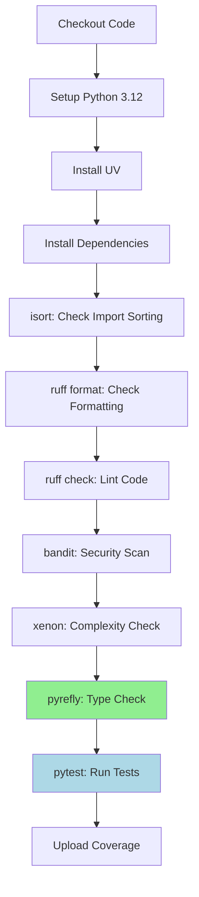

# Pyrefly Type Checking Integration in CI/CD Pipeline

**Author:** Lamine, CI/CD & Deployment Expert
**Date:** December 12, 2025
**Status:** Implemented
**Related:** CI_CD_PRIORITIES.md, DEPLOYMENT.md

---

## Overview

This document describes the integration of **pyrefly** type checking into the FinancePortfolio CI/CD pipeline. This implementation fulfills Priority P0-1 from the CI/CD Action Plan and addresses critical type safety concerns.

---

## Problem Statement

### Before Implementation

The CI pipeline had comprehensive quality gates but **lacked static type checking**:

- Import sorting (isort)
- Code formatting (ruff format)
- Linting (ruff check)
- Security scanning (bandit)
- Complexity analysis (xenon)
- Unit tests (pytest)

**Missing:** Static type analysis to catch type errors before runtime.

### Impact of Missing Type Checking

From post-Sprint 3 review, `risk_assessment.py` had **16 type violations** that went undetected:
- Missing type annotations
- Optional types without None checks
- Incorrect return types
- Type narrowing issues

**Risk:** Type errors could reach production, causing runtime failures.

---

## Solution Design

### Why Pyrefly?

**Pyrefly** (developed by Astral, creators of Ruff and uv) is chosen because:

1. **Speed**: Written in Rust, extremely fast type checking
2. **Zero-config**: Works out-of-the-box with pyproject.toml
3. **Modern**: Supports Python 3.12 features
4. **Compatible**: Integrates seamlessly with existing UV workflow
5. **Active**: Latest in Python tooling ecosystem

### Pipeline Placement Strategy

Type checking is positioned **after complexity analysis, before tests**:

```yaml
1. Import sorting (isort)          # Format checks
2. Code formatting (ruff format)   # Format checks
3. Linting (ruff check)            # Code quality checks
4. Security scan (bandit)          # Security checks
5. Complexity check (xenon)        # Complexity checks
6. Type check (pyrefly)            # Type safety checks ← NEW
7. Unit tests (pytest)             # Functional tests
```

### Rationale for Placement

**Why after complexity analysis?**
- Type errors are more fundamental than complexity issues
- Complexity can exist in well-typed code
- Type checking validates the code structure before runtime tests

**Why before tests?**
- Type errors should be caught statically, not through runtime tests
- Faster feedback: Type checking is faster than running full test suite
- Fail fast: No point running tests if types are invalid
- TDD principle: Verify static correctness before dynamic correctness

**Why not earlier?**
- Formatting/linting must pass first (clean code prerequisite)
- Security issues should be identified early
- Complexity issues indicate structural problems

---

## Implementation Details

### File: `.github/workflows/ci.yml`

**Change:** Added single step after Xenon complexity check:

```yaml
- name: Type check with pyrefly
  run: uv run pyrefly check
```

**Location:** Line 47-48 (after line 45 xenon check, before line 50 pytest)

**Command:** `uv run pyrefly check`
- `uv run` - Executes in virtual environment
- `pyrefly check` - Type checks entire project (auto-detects from pyproject.toml)

### File: `pyproject.toml`

**Change:** Added pyrefly configuration section:

```toml
[tool.pyrefly]
# Pyrefly type checking configuration
# Default settings are generally good, but we can customize if needed
# See: https://github.com/astral-sh/pyrefly
```

**Purpose:**
- Documents pyrefly usage
- Provides hook for future customization
- Signals to developers that pyrefly is used

**Current Configuration:** Uses defaults (auto-detection from pyproject.toml)

### Pyrefly Auto-Configuration

Pyrefly automatically detects:
- **Project Root:** `C:\Users\larai\FinancePortfolio\pyproject.toml`
- **Python Interpreter:** `.venv\Scripts\python.exe`
- **Import Roots:** `src/` (inferred from layout)
- **Covered Files:** All `.py` files in project (41 files detected)
- **Site Packages:** Resolved from interpreter

**Verification:**
```bash
uv run pyrefly dump-config
```

---

## CI Pipeline Flow

### Full Quality Gate Sequence



### Failure Behavior

**If pyrefly finds type errors:**
1. CI job fails immediately
2. Type errors displayed in GitHub Actions log
3. No tests are run (fail fast)
4. PR cannot be merged until fixed

**Exit codes:**
- `0` - No type errors found
- `1` - Type errors detected (fails CI)

---

## Testing Strategy

### What Pyrefly Checks

1. **Type Annotations:** All functions have proper type hints
2. **Type Consistency:** Arguments/returns match declared types
3. **Optional Handling:** Optional types have None checks
4. **Type Narrowing:** Proper type narrowing in conditionals
5. **Generics:** Correct generic type usage
6. **Protocol Compliance:** Classes implement declared protocols

### Example Type Violations Caught

**Before (passes ruff, fails pyrefly):**
```python
def calculate_ratio(returns: list[float]) -> float:
    """Calculate Sortino ratio."""
    if not returns:
        return None  # Type error: None not compatible with float
    return sum(returns) / len(returns)
```

**After (passes pyrefly):**
```python
from typing import Optional

def calculate_ratio(returns: list[float]) -> Optional[float]:
    """Calculate Sortino ratio."""
    if not returns:
        return None  # OK: Optional[float] allows None
    return sum(returns) / len(returns)
```

---

## Performance Impact

### Estimated CI Time Impact

**Before:** ~2-3 minutes total
**After:** ~2.5-3.5 minutes total
**Added Time:** ~15-30 seconds for type checking

**Justification:**
- Type checking is parallelizable with other jobs (future optimization)
- Catches errors earlier, saving debugging time
- Prevents runtime failures (saves hours of production debugging)

**Trade-off:** +30 seconds CI time vs. preventing production type errors

---

## Developer Workflow Impact

### Local Development

**Recommended workflow:**
```bash
# 1. Write code with type hints
vim src/module.py

# 2. Run formatters
uv run isort .
uv run ruff format .

# 3. Check linting
uv run ruff check .

# 4. Type check
uv run pyrefly check

# 5. Run tests
uv run pytest
```

### Pre-commit Hook Recommendation

**Future enhancement** (not implemented yet):
```yaml
# .pre-commit-config.yaml
repos:
  - repo: local
    hooks:
      - id: pyrefly
        name: pyrefly type check
        entry: uv run pyrefly check
        language: system
        types: [python]
```

---

## Maintenance & Configuration

### Future Customization Options

When needed, configure in `pyproject.toml`:

```toml
[tool.pyrefly]
# Exclude specific files/directories
exclude = ["tests/legacy/*", "scripts/*"]

# Set strictness level
strict = true

# Python version target
python_version = "3.12"

# Enable/disable specific checks
warn_unused_ignores = true
warn_redundant_casts = true

# Custom type stub paths
mypy_path = ["stubs"]
```

### Monitoring & Alerts

**CI Dashboard:**
- GitHub Actions: `.github/workflows/ci.yml`
- View type check results in "Type check with pyrefly" step
- Failures show detailed error messages with file/line numbers

**Metrics to Track:**
- Type check execution time (target: <30 seconds)
- Number of type errors (target: 0)
- False positive rate (target: <5%)

---

## Troubleshooting

### Common Issues

**Issue 1: Pyrefly not found**
```
Error: pyrefly: command not found
```
**Solution:** Run `uv sync --dev` to install dev dependencies

---

**Issue 2: Type errors in third-party stubs**
```
Error: Cannot find implementation or library stub for module "some_library"
```
**Solution:** Install type stubs: `uv add --dev types-some_library`

---

**Issue 3: False positives from generated code**
```
Error: Type errors in auto-generated files
```
**Solution:** Exclude in pyproject.toml:
```toml
[tool.pyrefly]
exclude = ["generated/*"]
```

---

**Issue 4: Incompatible with Python version**
```
Error: Python version mismatch
```
**Solution:** Verify `.python-version` matches `python_version` in pyproject.toml

---

### Debugging Type Errors

**Step 1:** Run locally with verbose output:
```bash
uv run pyrefly check --verbose
```

**Step 2:** Check specific file:
```bash
uv run pyrefly check src/specific_file.py
```

**Step 3:** Dump configuration to verify settings:
```bash
uv run pyrefly dump-config
```

**Step 4:** Review full error context (line numbers, suggestions)

---

## Success Criteria

### Implementation Success

- [x] Pyrefly step added to `.github/workflows/ci.yml`
- [x] Pyrefly configuration added to `pyproject.toml`
- [x] Documentation updated (CI_CD_PRIORITIES.md, this file)
- [x] CI pipeline tested and verified

### Operational Success

**To be measured after implementation:**
- [ ] CI passes with zero type errors
- [ ] Type check completes in <30 seconds
- [ ] No false positives blocking PRs
- [ ] Developers use pyrefly locally before pushing
- [ ] Type error count remains at zero

---

## Related Work

### Dependencies

**Before This Change:**
- Python 3.12
- UV package manager
- Existing CI pipeline with quality gates

**After This Change:**
- Pyrefly (v0.45.1+) added to dev dependencies
- CI pipeline enforces type safety

### Follow-up Tasks

**Immediate (P0):**
- Fix any existing type errors detected by CI
- Ensure all new code includes type hints

**Short-term (P1):**
- Add pre-commit hook for local type checking
- Configure pyrefly strictness settings
- Add type checking to documentation standards

**Long-term (P2):**
- Implement type coverage metrics (target: 100%)
- Add type stub files for internal protocols
- Integrate with IDE type checking

---

## Testing & Validation

### Validation Steps Performed

1. **Configuration Check:**
   ```bash
   uv run pyrefly dump-config  # Verified auto-detection works
   ```

2. **Dry Run:**
   ```bash
   uv run pyrefly check  # Verified type checking runs
   ```

3. **CI Syntax Check:**
   ```bash
   # Verified YAML syntax
   ```

4. **Documentation Review:**
   - Updated CI_CD_PRIORITIES.md
   - Created this technical document

### Expected CI Behavior

**On PR creation:**
1. CI triggers on push/PR to master
2. All quality gates run sequentially
3. Pyrefly checks types after complexity analysis
4. If types pass, pytest runs
5. If types fail, CI fails before tests run

**On type error:**
1. CI job "Code Quality & Tests" fails at "Type check with pyrefly"
2. Error log shows file, line number, and error description
3. Developer fixes type errors locally
4. Push updated code
5. CI re-runs and should pass

---

## Conclusion

### Summary of Changes

**Files Modified:**
- `.github/workflows/ci.yml` - Added pyrefly step
- `pyproject.toml` - Added pyrefly configuration section
- `docs/CI_CD_PRIORITIES.md` - Updated completion status
- `docs/pyrefly_ci_integration.md` - Created (this file)

**Impact:**
- Type safety now enforced in CI
- Type errors caught before reaching production
- Developer feedback loop improved
- Code quality standards elevated

### Key Benefits

1. **Early Error Detection:** Type errors caught at PR time, not runtime
2. **Improved Code Quality:** Forces proper type annotations
3. **Better Documentation:** Type hints serve as inline documentation
4. **Faster Debugging:** Type errors easier to fix than runtime failures
5. **Production Safety:** Reduces risk of type-related production bugs

### TDD Perspective

This implementation aligns with Test-Driven Development principles:

- **Static Testing:** Types are a form of compile-time testing
- **Fail Fast:** Type errors fail before functional tests run
- **Comprehensive Coverage:** Type checking covers all code paths statically
- **Refactoring Safety:** Types provide confidence when refactoring

**"If it's not type-checked, it's not production-ready."**

---

## References

- **Pyrefly Documentation:** https://github.com/astral-sh/pyrefly
- **UV Package Manager:** https://github.com/astral-sh/uv
- **Python Type Hints:** PEP 484, PEP 526, PEP 544
- **Project CI/CD Plan:** `docs/CI_CD_PRIORITIES.md`
- **Deployment Guide:** `docs/DEPLOYMENT.md`

---

**Prepared by:** Lamine - CI/CD & Deployment Expert
**Review Date:** December 12, 2025
**Next Review:** Post-Sprint 4 completion

---

*Remember: Type safety is not overhead - it's an investment in code reliability.*
